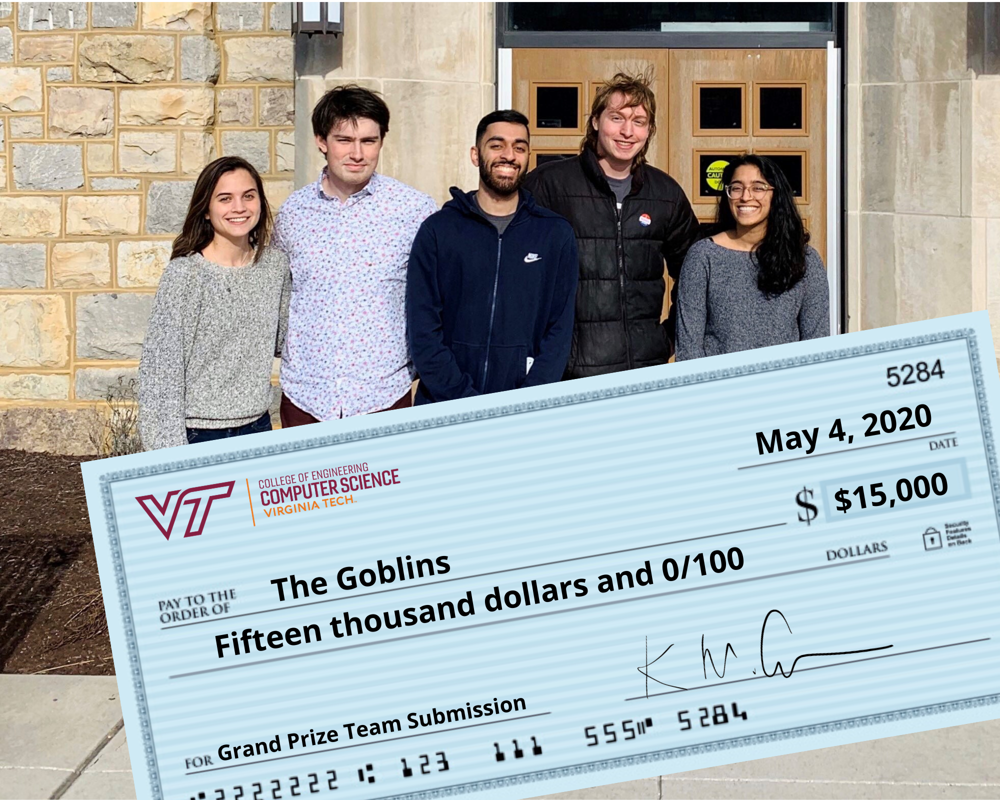
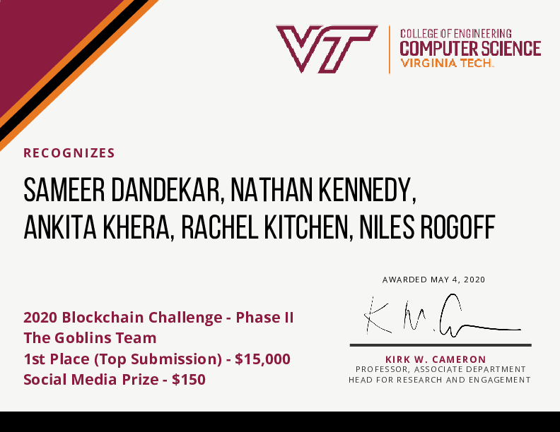
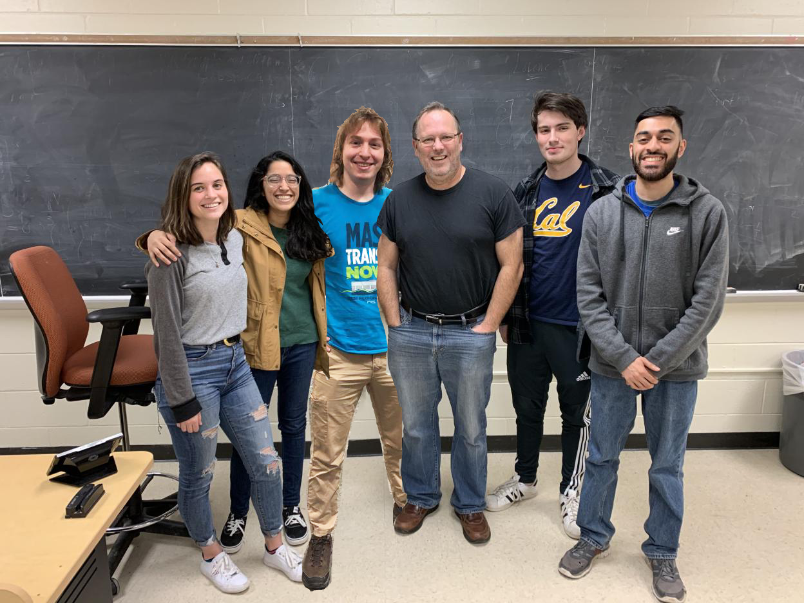
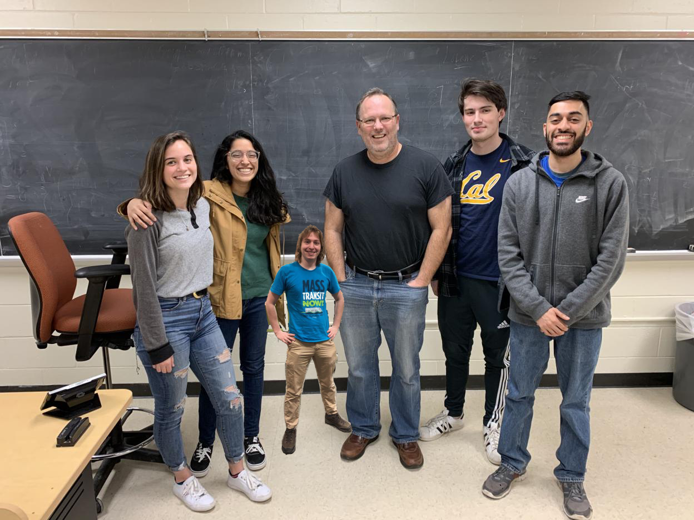
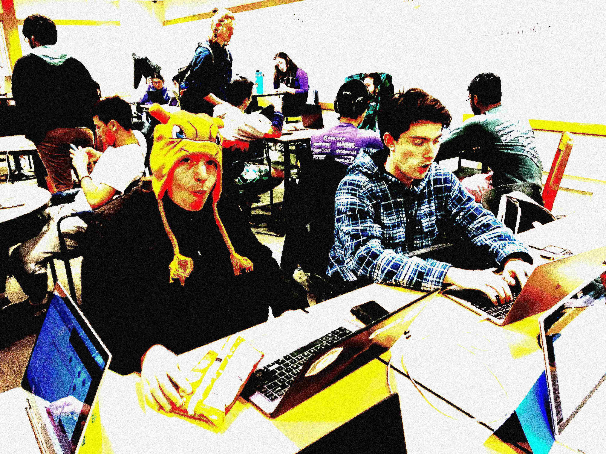
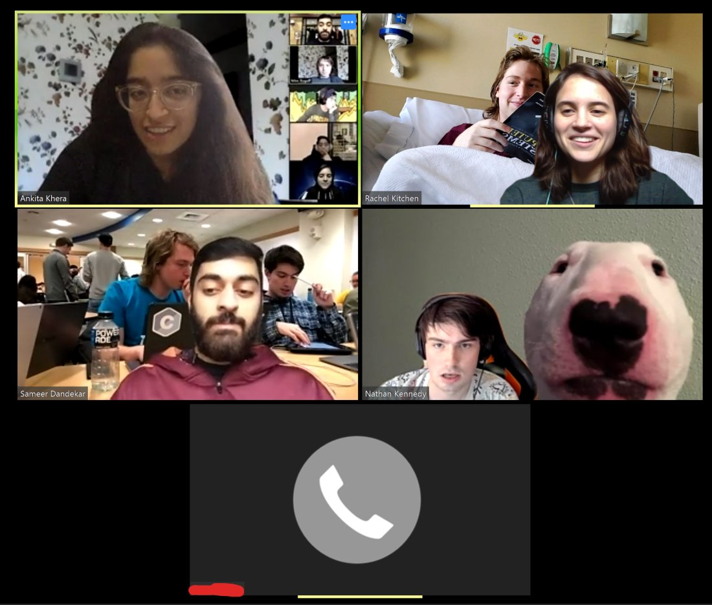

# HokieTickets is an [EOSIO](https://eos.io)-based application for simple and fair student athletic ticket management, winner of the 2020 Virginia Tech Blockchain Challenge.

HokieTickets was a group project created by The Goblins 👺 as part of Virginia Tech's CS4284 Systems and Networking Capstone. 

Our project won first place in both rounds of the 2020 Virginia Tech Blockchain Challenge, and our team won both social media prizes

Pictured: The Goblins (left to right: Rachel Kitchen, Nathan Kennedy, Sammer Dandekar, **Niles Rogoff**, Ankita Khera)

Here is a brief (90 second) introduction to what HokieTickets can do (click to watch the video)

We also won both social media prizes for our twitter account [@goblinsvt](https://twitter.com/goblinsvt)

You can see our code in the following subdirectories:

|Repository Link| |
|--|--|
|[`www`](https://github.com/nilesr/HokieTickets/tree/master/www)|Web-based Frontend|
|[`libgoblin`](https://github.com/nilesr/HokieTickets/tree/master/libgoblin)|Blockchain Integration Library|
|[`hokipoki`](https://github.com/nilesr/HokieTickets/tree/master/hokipoki)|Blockchain Smart Contract|
|[`football-tickets`](https://github.com/nilesr/HokieTickets/tree/master/football-tickets)|iOS Companion App|

Each project has its own associated readme

Small version:

First round certificate:

